# OCI のトライアル環境へのアクセスと環境セットアップ(Lab.1)

## はじめに

このハンズオンは、Oracle Autonomous DBを利用した各言語での開発に必要な環境設定方法の確認と動作の体験をゴールとしています。


# OCI のトライアル環境へのアクセス

まず、トライアル環境へのアクセスを行います。

### 作業ステップ
1. 事前にOracle Code Tokyo主催者より、皆さま宛にOracle Cloud Infrastructure のトライアル環境に関するシステムメールが送付されているはずです。
もしそのメールに書かれている手順(環境のアクティベーション)が完了していない方は、この場でメールの指示に従って処理を完了してください。

1. セットアップが完了している方は、以下のURLにアクセスしてください

```text
https://console.us-ashburn-1.oraclecloud.com
```

1. 表示されたログイン画面の Cloud Tenant に、皆さま向けに払い出されたクラウドのテナント名(Identity Domain名)を入力し、Continue ボタンを押します

1. 左側の Single Sign-On(SSO)というセクションの側の **Continue** というボタンを押します

1. **ユーザー名** (皆様のメールアドレスのはずです) と **パスワード** を入力し、サイン・イン ボタンを押します
パスワードは、トライアル環境のアクティベーション後に一度でもログインしている場合には、その初回アクセス時にみなさまが設定されています。もしアクティベーション後に一度もログインしていない場合は、アクティベーション時に送付されたメールに書かれていますので、それを使用してください。


1. 以下のようなコンソールが表示されたら、ログインが成功しています。

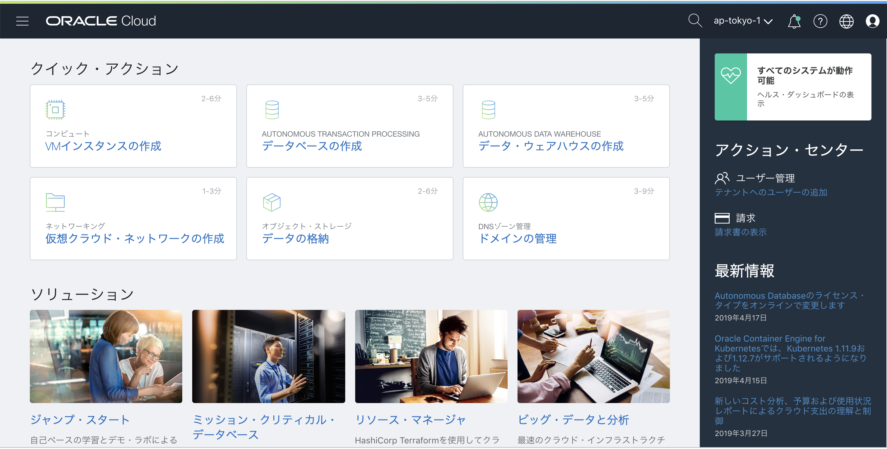


## アプリケーションの実行環境イメージのインポート

今回のハンズオンでは、予めハンズオン主催者側で作成しておいた Oracle Linux 7 の仮想マシンイメージを使用して、アプリケーションの実行環境を作成します。
その利用にあたり、まずはその仮想マシンイメージをみなさまのそれぞれの環境にカスタム・イメージとしてインポートする作業を行います。この作業には少し時間がかかるため、最初に行っておくことで、ハンズオンがスムーズに進むようになります。

### 作業ステップ
1. コンソールメニューから **コンピュート → カスタム・イメージ** を選択し、**イメージ・インポート** ボタンを押します

1. 立ち上がったウィンドウに以下の項目を入力し、下部の **イメージ・インポート** ボタンを押します
    - **コンパートメントに作成** - デフォルトで現在のコンパートメントが選択されています。もし別のコンパートメントに作成したい場合は選択します。
    - **名前** - 任意の文字列
    - **オペレーティング・システム** - Linuxを選択
    - **オブジェクト・ストレージURL** - 以下の文字列をコピー&ペースト
`https://objectstorage.ap-tokyo-1.oraclecloud.com/n/orasejapan/b/code19-coding-hol/o/code19-coding-hol`

    - **イメージ・タイプ** - OCI を選択
    - **起動モード** - グレーアウトされるので選択不要

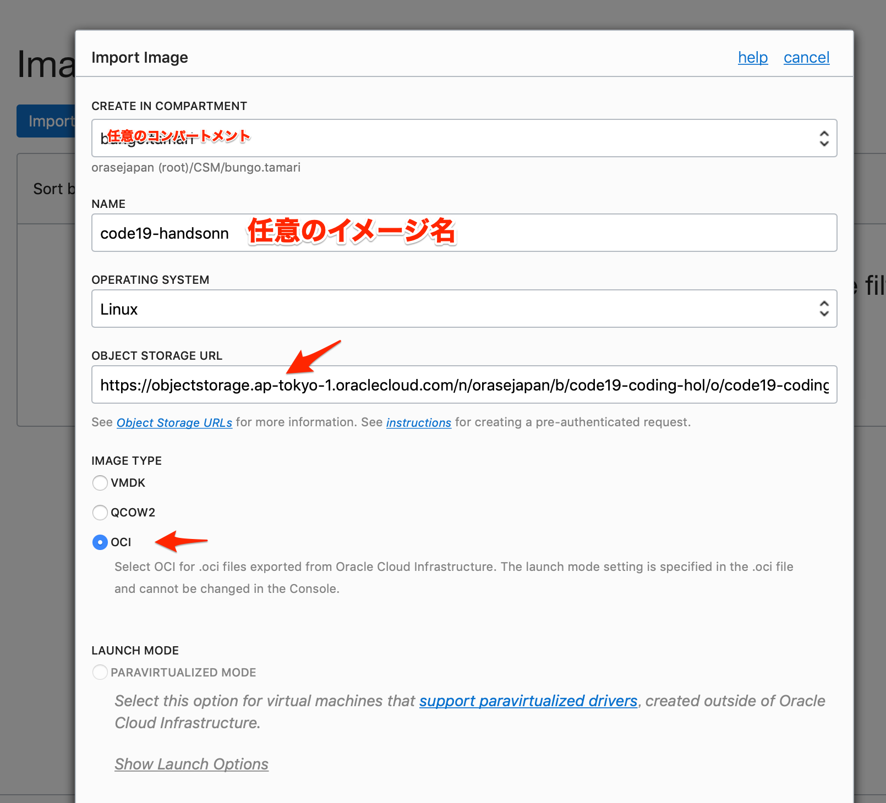


インポート中というステータスの画面が表示されていたら、バックグラウンドで アプリケーションの設定済イメージのインポート作業が開始されていますので、別の画面へと遷移してしまってもOKです。カスタム・イメージのインポートが完了すると、コンソール上の状態が **使用可能** になります。
完了までにはしばらく時間がかかるので、その間に次の作業を開始してしまいしょう。


## Autonomous Database の作成

さて、いよいよ今回のメインディッシュ、Autonomous Database をクラウド上に作成します。Autonomous Database は、自律型の Oracle Database のマネージドサービスで、組み込みのAIによって管理が自動化されています。現在のところ、Oracle Cloud Infrastructure(OCI) でのみ使用が可能です。
今回は、OCIのコンソールから Autnomous Database を作成していきましょう。

### 作業ステップ
1. コンソールメニューから **Autonomous Transaction Processing** を選択し、**Autonoous Databaseの作成** ボタンを押します

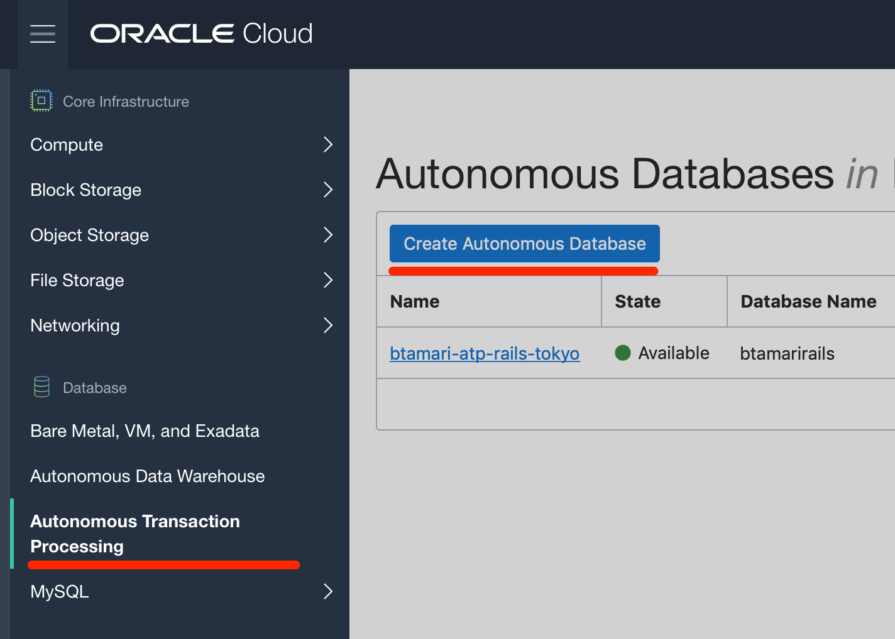


1. 立ち上がったウィンドウに以下の項目を入力し、下部の **Autonomous Databaseの作成** ボタンを押します
    - **ワークロード・タイプ** - AUTONOMOUS TRANSACTION PROCESSING を選択
    - **コンパートメント** - デフォルトで現在のコンパートメントが選択されています。もし別のコンパートメントに作成したい場合は選択します。
    - **表示名** - 任意の文字列
    - **DATABASE NAME** - orcl
    - **CPUコア数** - 1
    - **ストレージ(TB)** - 1
    - **パスワード** - 今回のハンズオンでは「Oracle123456」を利用します。もしくは12文字以上の任意のパスワード。
    - **ライセンス・タイプ** - SUBSCRIBE TO NEW DATABASE SOFTWARE LICENSES AND THE DATABASE CLOUD SERVICE を選択

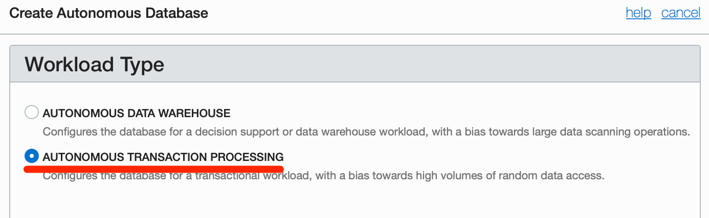
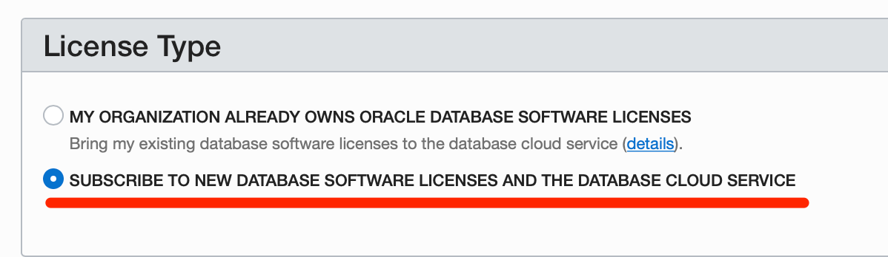


バックグラウンドで Autnomous Database の作成が開始します。作成にはしばらく時間がかかるので、その間に次の作業を開始してしまいしょう。Autonomous Database の作成が完了すると、コンソール上の状態が **使用可能** になります。


## クラウドに仮想ネットワーク(VCN)を作る

アプリケーションの稼働環境となる仮想マシン・インスタンスを作成するには、クラウド上に仮想的なプライベート・ネットワーク(Virtual Cloud Network : VCN) を予め作成しておく必要があります。最初にネットワークの管理者が仮想ネットワークを作ることで、その後インスタンスの管理者やストレージの管理者が、作成した仮想ネットワークの構成やルールに従ってコンポーネントを配置することができるようになります。
今回はコンソール画面からテンプレートに従って仮想クラウド・ネットワーク(VCN)を1つ作成し、後のステップでそこにアプリケーションを実行する仮想マシン・インスタンスを配置します。

### 作業ステップ
1. コンソールメニューから **ネットワーキング(Networking) → 仮想クラウド・ネットワーク(Virtual Cloud Networks)** を選択し、**仮想クラウド・ネットワークの作成** ボタンを押します

1. 立ち上がったウィンドウに以下の項目を入力し、下部の **仮想クラウド・ネットワークの作成** ボタンを押します
    - **名前** - 任意 (画面では TutorialVCN と入力しています)
    - **コンパートメントに作成** - デフォルトで現在のコンパートメントが選択されています。もし別のコンパートメントに作成したい場合は選択します。
    - **仮想クラウド・ネットワークおよび関連リソースの作成** - ラジオボタンを選択します。このオプションを選択すると仮想クラウド・ネットワーク(VCN)と付随するネットワーク・コンポーネントが事前定義済のテンプレートに従って作成され、簡単にクラウド上の仮想ネットワークの利用を開始することができます。

    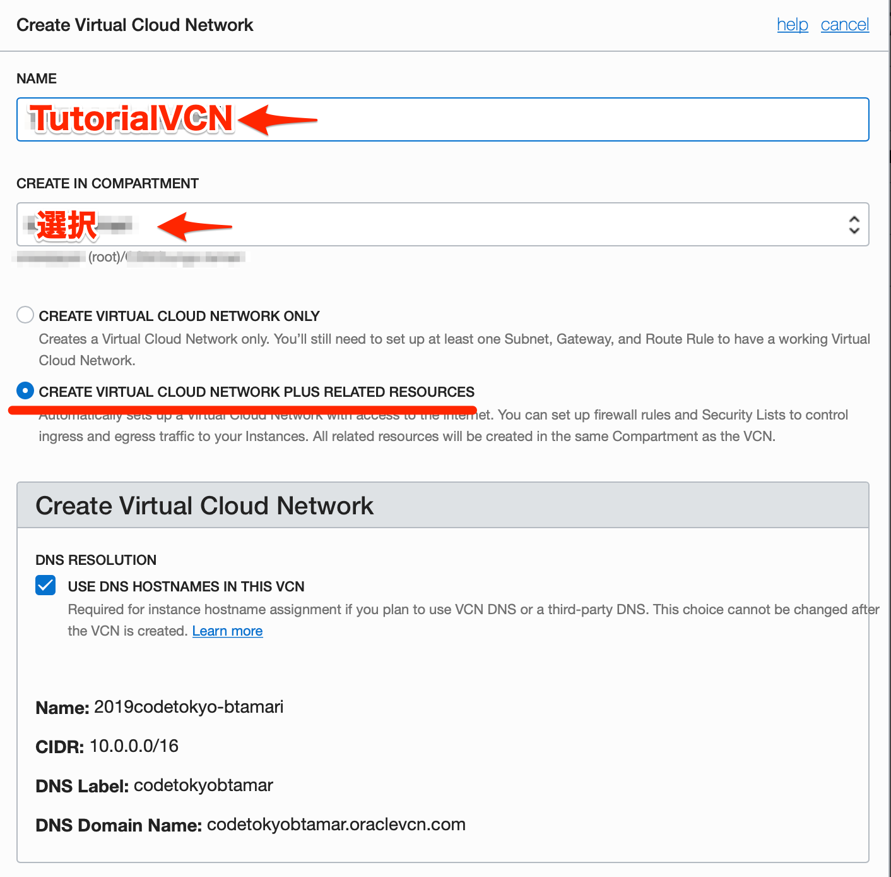


1. すべてのアクションが正常に実行されたことをメッセージで確認し **閉じる** ボタンを押しウィンドウを閉じます

1. コンソール上に作成した仮想クラウド・ネットワークが表示され、状態が **使用可能** になっていることを確認します


以上で仮想クラウド・ネットワークの作成は完了です。


## 仮想ネットワーク(VCN)のファイアウォールに、httpアクセス用のポートを解放する

作成したばかりのVCNは、セキュリティ強化のために外部からのhttp関連のポートが全て閉じられています。この先のステップで、このVCNの中にWebアプリケーションを立ち上げますので、この時点で予め必要となるポートを開いておきます。

### 作業ステップ
1. コンソールメニューから **ネットワーキング(Networking) → 仮想クラウド・ネットワーク(Virtual Cloud Networks)** を選択し、先ほど作成したVCN名のリンクをクリックします。

1. 左下の **リソース** メニューから **セキュリティ・リスト** を選択し、その右側のセキュリティ・リスト一覧の中から **Default Security List for XXX** という名前のリンクをクリックします。

1. **イングレス・ルールの追加** ボタンを押し、立ち上がったウィンドウに以下の情報を入力し、**イングレス・ルールの追加** ボタンを押します。

    - **ソース・タイプ** : CIDR
    - **ソースCIDR** : 0.0.0.0/0
    - **IPプロトコル** : TCP
    - **ソースポート範囲** : 空欄のまま
    - **宛先ポート範囲** : _※使用するフレームワーク毎に設定_
        - **Ruby on Rails** : 3000
        - **Django** : 8000
        - **Laravel** :8080
        - **Spring Boot** : 80

    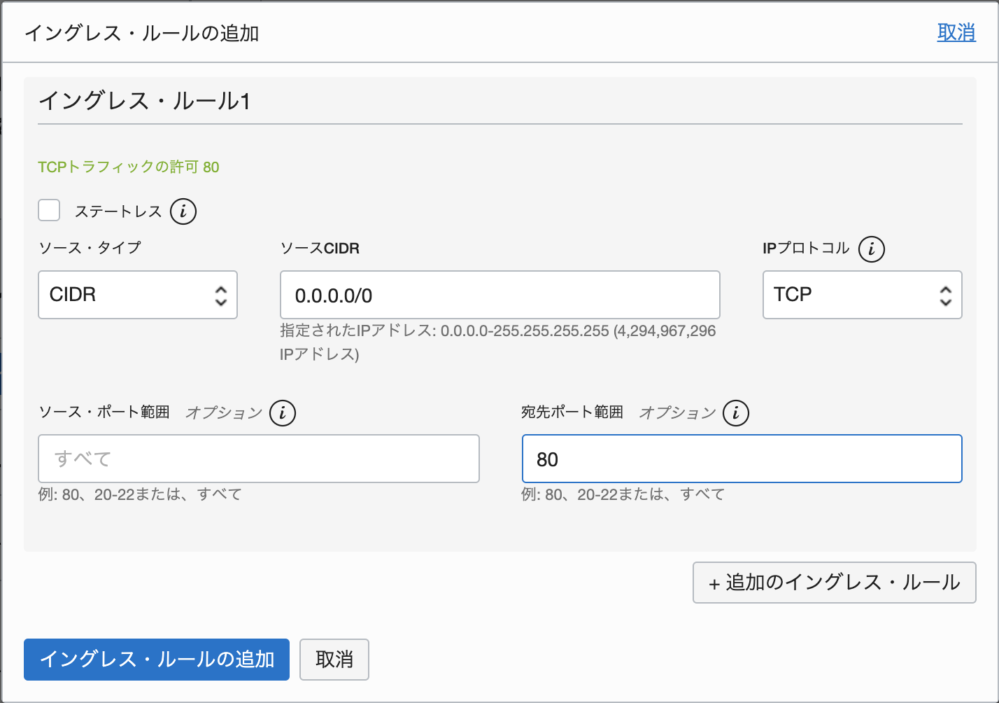


## アプリケーション実行用のインスタンス作成と Autonomous Database への接続確認

カスタム・イメージのインポートがそろそろ完了している頃なので、そのイメージを使って仮想マシン・インスタンスを立ち上げましょう。

### 作業ステップ

1. コンソールメニューから **コンピュート → カスタム・イメージ** を選択し、先ほどインポートしておいたイメージが表示され、状態が **使用可能** になっていることを確認します。

1. イメージ欄の右端の **・・・** メニューをマウスオーバーし、 **インスタンスの作成** を選択します

    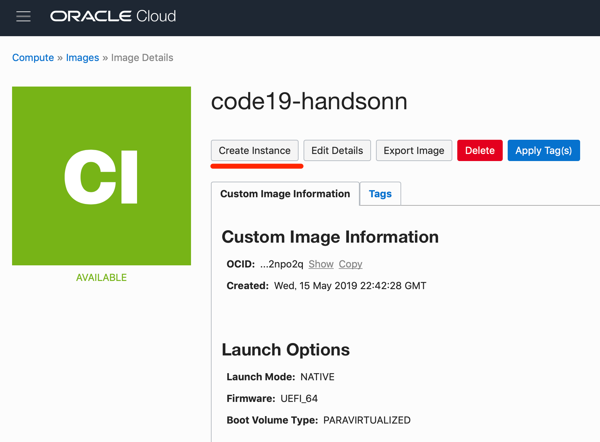


1. 立ち上がったウィンドウに以下の項目を入力し、下部の **作成** ボタンを押します
    - **インスタンスの命名** - 任意の名前
    - **インスタンスの可用性ドメインを選択します** - 可用性ドメイン1 を選択
    - **オペレーティング・システムまたはイメージ・ソースを選択します** - インポートしたカスタム・イメージを選択(デフォルトのまま)
    - **インスタンス・タイプの選択** − 仮想マシン を選択
    − **インスタンス・シェイプの選択** - シェイプの変更 ボタンをおして、VM.Standard2.2 を選択し、下部の **シェイプの選択** ボタンを押す
    - **ブート・ボリュームの構成** - 全てチェックなし(デフォルトのまま)
    - **SSHキーの追加** - **ファイルの選択** ボタンを押して予め作成しておいた鍵ペアのうち公開鍵(通常は id_rsa.pub )を選択
    - **仮想クラウド・ネットワーク** - 先ほどのステップで作成したVCNを選択
    - **サブネット** - 任意のパブリック・サブネットを選択

1. インスタンスの作成処理がバックグラウンドで作成されます。しばらくするとインスタンスの状態が **実行中** になり、使用できるようになります

    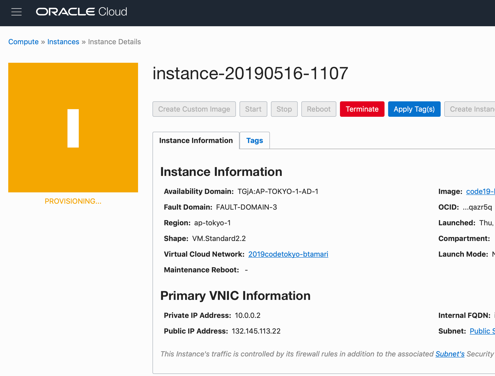


1. 作成したインスタンスにSSHで接続確認をします。
インスタンスの詳細画面の **プライマリVNIC情報** セクションにある **パブリックIPアドレス** 欄のIPアドレスをコピーし、そこに対してローカルのPCからSSHでアクセスします。アクセスする際の認証には、インスタンスを作成する際に登録したSSH公開鍵のペアとなる秘密鍵(通常はid_rsaという名前です)を使用してください。秘密鍵にパスコードを指定している場合はそちらも適切に指定してください。
アクセスするユーザーは *opc* です。

```text
localpc% ssh -i <your_secret_key> opc@<your_innstance_address>

remote%
```

2. 次に、仮想マシンインスタンスに、Autnomous Database へのアクセスを行うためのクライアント資格証明(Wallet)を配置します。
コンソールメニューから **Autonomous Transaction Processing** を選択し、先ほど作成した Autnomous Database の名前のリンクをクリックします。

3. **DB接続** ボタンを押します

4. 立ち上がったウィンドウの **クライアント資格証明(ウォレット)のダウンロード** セクションにある **ダウンロード** ボタンを押します

    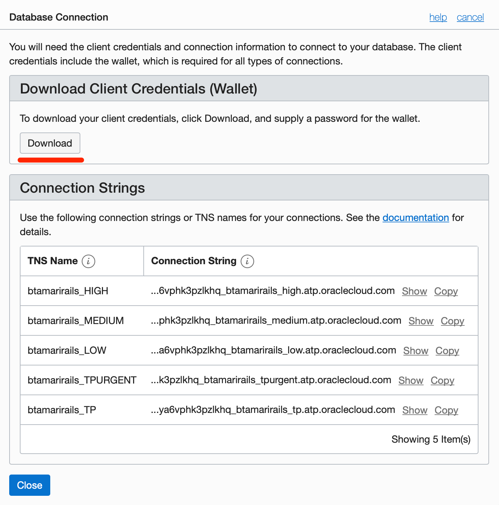

5. **パスワード** と **パスワード確認** に適切な値を入力し、zipファイル形式のWalletをローカルマシンにダウンロードします。

6. 先ほど作成したアプリケーション用の仮想マシンに、Walletファイルを配置します。

```sh
localpc% scp -i <YourIdentitySecretKey> <YourWallet>.zip opc@<your_innstance_address>:
```

7. Walletファイルを移動し、解凍します。

```text
remote% sudo cp <YourWallet>.zip /usr/local/etc/
remote% cd /usr/local/etc/
remote% sudo unzip <YourWallet>.zip
```

8. 解答したディレクトの中にある sqlnet.ora ファイルを、Wallet配置先の記載を現状にあわせて修正します。

```text
remote% sudo cp sqlnet.ora sqlnet.ora.org && cat sqlnet.ora.org | sudo sh -c "sed -e 'N;s/\?\/network\/admin/\/usr\/local\/etc/g' > sqlnet.ora"
```

9. (オプション : この手順は今回の環境では事務局側で設定済です)

    - 環境変数TNS_ADMINに、Walletファイルの配置先を設定します
    - LD_LIBRARY_PATHにOracle Client の中の lib ディレクトリの位置を与えます。
※ MacOSの場合はLD_LIBRARY_PATHの設定が制限されていますので、今回のようにクラウド上のインスタンスを使用するか、または Docker上のLinuxコンテナの使用を推奨します。

```text
echo 'export LD_LIBRARY_PATH="/usr/lib/oracle/18.5/client64/lib"' >> ~/.bash_profile
echo 'export TNS_ADMIN="/usr/local/etc"' >> ~/.bash_profile
```

10. sql*plus を使って、Autonomous DB への接続確認をします。
作成したAutonomous DBのインスタンスの **TNS名** を確認し、"TP" という名前ので終わるTNS名をメモします。TPは、一般トランザクション処理用に予め用意されたデータベース・サービスです。

    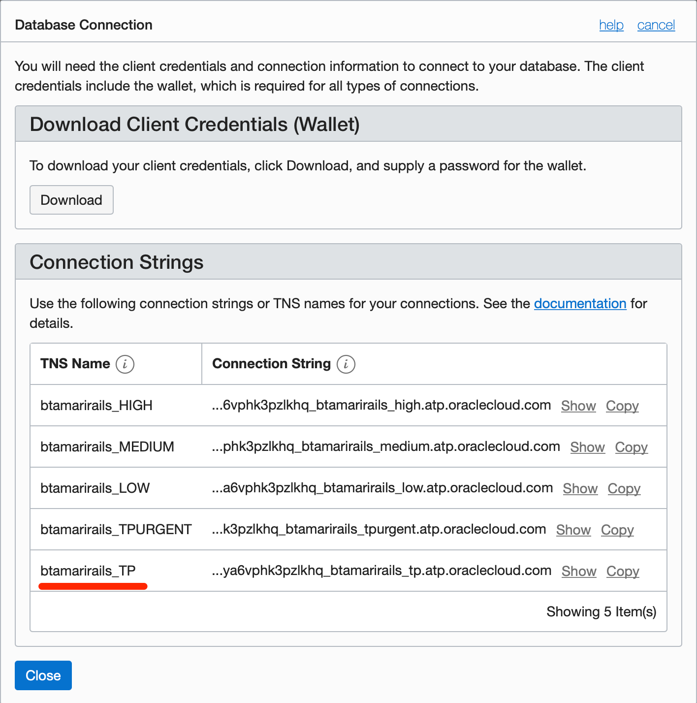

11. sql*plus を使って Autonomous Database に接続します。

```text
remote% /usr/lib/oracle/18.3/client64/bin/sqlplus admin@<インスタンスTNS名で_tpで終わるもの>

Password: Oracle123456(インスタンス作成時にadmin設定したパスワード）
```

12. プロンプトが帰ってきたら、アプリケーション用インスタンスから Autonomous Database への接続が無事に成功しています。


ここまでで、言語共通の作業は完了です。このあとは Lab.2 に進み、各言語ごとのグループに別れて作業を行っていきます。
